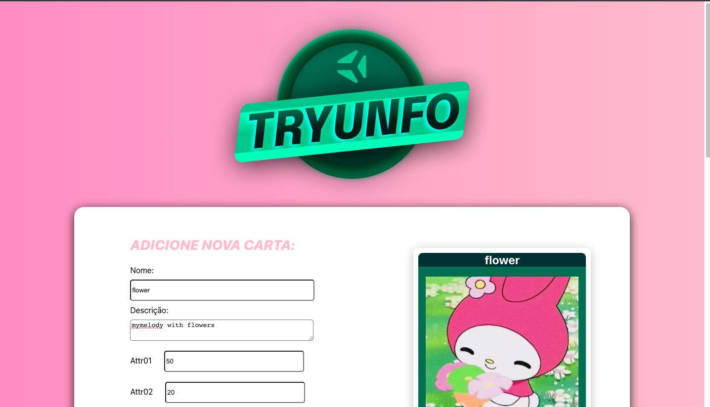
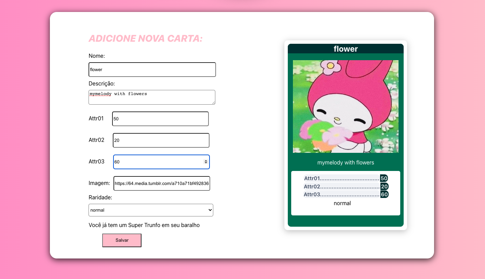
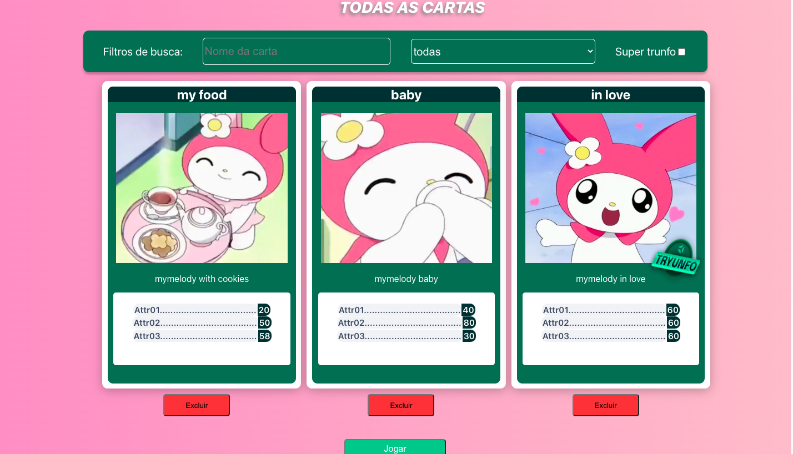
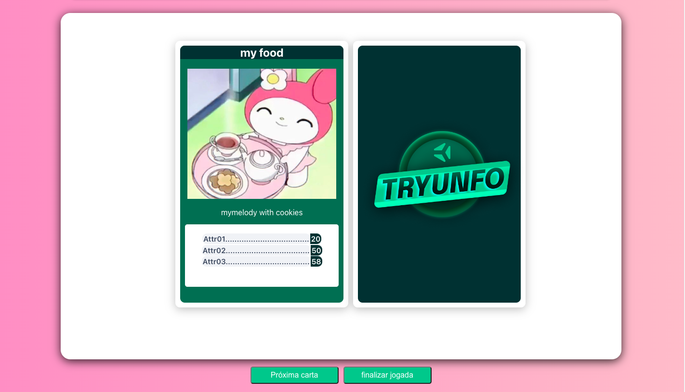

# Tryunfo

Tryunfo is a game in the style of Super Trunfo! By using this application a user is able to:

- Create a deck with the free theme;
- Add and remove a card from the deck;
- View all cards that have been added to the deck;
- Play with created deck;

<div align="center" display="inline">




</div>

## Run locally:
- First clone the repository into your machine;

```
git clone git@github.com:GabiNamu/Tryunfo.git
```

- Go to the project directory:
```
cd Tryunfo
```
 
- Install dependencies;

```
npm install
```
- Start the server;
```
npm start
```
## Main technologies used:
- React;
- JavaScript;
- Css;

